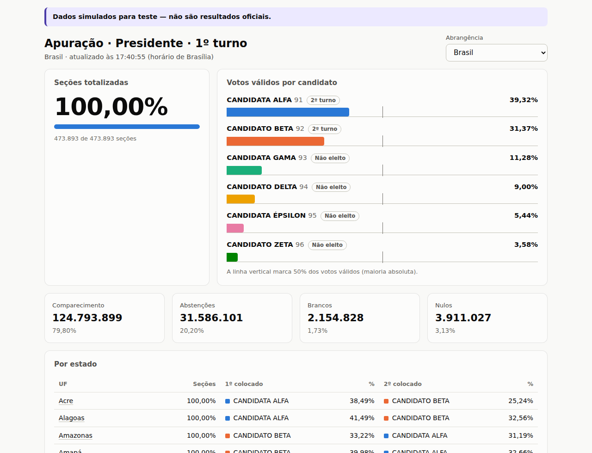
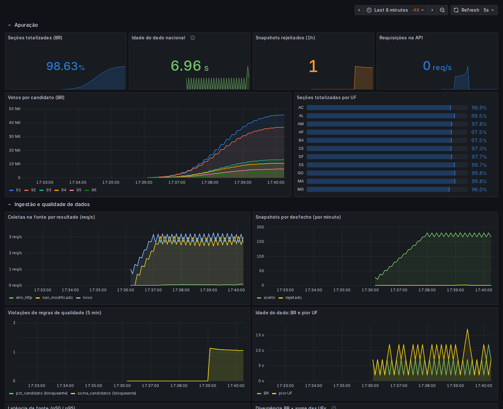

# Apuração presidencial

Arquitetura e implementação de referência de um site que acompanha, em tempo real, a apuração da
eleição para Presidente a partir dos dados oficiais do TSE. Foi pensada para aguentar o pico da
noite da eleição, nunca publicar número inconsistente e ser monitorada pelo que importa: o
frescor e a qualidade do dado.

📐 **Documento de arquitetura completo: [docs/ARQUITETURA.md](docs/ARQUITETURA.md)**



> Os dados acima são **fictícios**, gerados pelo simulador do TSE incluído no projeto.

## Visão rápida

```
TSE ──GET condicional──▶ Ingestor ──▶ PostgreSQL (auditoria + histórico)
                            │
                            └──SET + PUBLISH──▶ Redis ──▶ API (N réplicas, memória) ──▶ CDN/borda ──▶ navegador
                                                                                          cache 5 s
Prometheus ◀── métricas (ingestor, API) ──▶ Grafana / alertas
```

- **Ingestor:** coleta os 29 arquivos (BR, 27 UFs, exterior), deduplica por hash, normaliza,
  aplica regras de qualidade, grava a camada bruta e a normalizada e publica.
- **API:** somente leitura e sem estado; serve da memória com ETag e cabeçalhos de cache para a CDN.
- **Borda:** cache de 5 s, coalescência de requisições e "servir o último dado bom" se a origem cair.
- **Observabilidade:** idade do dado, snapshots rejeitados por regra, divergência BR × UFs,
  golden signals da API, 13 alertas e um painel provisionado.

## Estrutura

```
apuracao-presidencial/
├── docs/ARQUITETURA.md        # documento de arquitetura (diagramas, decisões, capacidade, SLOs)
├── docker-compose.yml         # ambiente completo local
├── .env.example
├── services/
│   ├── mock-tse/              # simulador do feed do TSE (dados fictícios + injeção de falhas)
│   ├── ingestor/              # coleta → valida → Postgres → Redis
│   └── api/                   # API somente leitura (origem da CDN)
├── web/                       # front-end React + nginx (papel da CDN no ambiente local)
├── infra/
│   ├── postgres/init.sql      # esquema: camada bruta, normalizada e views
│   ├── prometheus/            # coleta e regras de alerta
│   └── grafana/               # datasource e painel provisionados
└── scripts/smoke-test.sh      # teste de fumaça ponta a ponta (usado no CI)
```

O pipeline de CI fica em [`../.github/workflows/apuracao-ci.yml`](../.github/workflows/apuracao-ci.yml).

## Como rodar

Pré-requisito: Docker com Compose v2.

```bash
cd apuracao-presidencial
cp .env.example .env          # opcional: ajusta duração da simulação, taxa de falhas etc.
docker compose up -d --build
./scripts/smoke-test.sh       # confere se está tudo de pé
```

| Endereço | O quê |
|---|---|
| http://localhost:8080 | Site |
| http://localhost:8080/api/v1/resultados/br | API (também `/sp`, `/zz` … e `/api/v1/resultados` para o resumo) |
| http://localhost:3001 | Grafana (abre direto no painel; usuário `admin`, senha `admin`) |
| http://localhost:9090/alerts | Prometheus, com o estado dos alertas |
| http://localhost:8081 | Simulador do TSE |

Por padrão a apuração simulada leva 15 minutos para chegar a 100% (`SIM_DURACAO_S`). Para
recomeçar do zero: `docker compose down -v && docker compose up -d`.



## Desenvolvimento

```bash
# testes unitários (Node 22, test runner nativo)
cd services/ingestor && npm ci && npm test
cd services/api      && npm ci && npm test
cd services/mock-tse && npm test

# front-end com hot reload, usando o backend do compose
cd web && npm ci && npm run dev   # http://localhost:5173 (proxy de /api para :8080)
```

## Explorando os dados

O Postgres fica exposto só em `127.0.0.1:5432` (usuário/senha/banco `apuracao`):

```bash
docker compose exec postgres psql -U apuracao -d apuracao
```

```sql
-- o que foi rejeitado e por quê
SELECT abrangencia, recebido_em, motivo FROM snapshot_bruto WHERE status = 'rejeitado';

-- atraso entre a geração no TSE e a chegada ao banco
SELECT abrangencia, max(atraso) FROM vw_atraso_ingestao GROUP BY 1 ORDER BY 2 DESC;

-- evolução dos candidatos no Brasil
SELECT gerado_em, pct_secoes, nome, pct FROM vw_evolucao_candidato WHERE abrangencia = 'BR';
```

## Simulando falhas

| Cenário | Como | O que observar |
|---|---|---|
| TSE instável | `FALHA_TAXA_5XX=0.3 docker compose up -d mock-tse` | Painel "Coletas por resultado"; alerta `FonteComFalhas` |
| TSE publicando arquivo inconsistente | `FALHA_TAXA_INCONSISTENTE=0.2 docker compose up -d mock-tse` | Snapshots rejeitados no painel e em `snapshot_bruto`; o site não exibe o dado ruim |
| TSE fora do ar | `docker compose stop mock-tse` | O site segue com o último dado; aviso de desatualizado após 3 min |
| API inteira fora | `docker compose stop api` | A borda responde `X-Cache-Status: STALE` com o último dado |
| Redis perdeu tudo | `docker compose exec redis redis-cli flushall` | O ingestor republica em até 60 s; as APIs nem percebem |
| Ingestor reiniciado | `docker compose restart ingestor` | Reidrata a partir do Postgres, sem duplicar registros |

Recriar o `mock-tse` reinicia a apuração simulada do zero. O ingestor publica os novos arquivos
(são mais recentes) e acusa `regressao_secoes`/`regressao_votos`: é o comportamento esperado e
serve para ver o alerta `RegressaoNaApuracao` em ação.

## Usando o feed real do TSE

No `.env`, aponte o ingestor para o TSE e marque a fonte como oficial:

```bash
ELEICAO=<código da eleição no ele-c.json do TSE>
TURNO=1
FONTE_URL_TEMPLATE=https://resultados.tse.jus.br/oficial/ele2026/{eleicao}/dados-simplificados/{abr}/{abr}-c0001-e{eleicao6}-r.json
FONTE_NOME=tse
```

⚠️ O adaptador (`services/ingestor/src/normalizar.js`) segue o layout publicado pelo TSE em 2022 e
**ainda não foi validado contra o feed de 2026**. Antes de qualquer uso real, confira o mapeamento
campo a campo (seção 19 do [documento de arquitetura](docs/ARQUITETURA.md#19-pendências-e-próximos-passos)).
Se o layout divergir, a regra de esquema rejeita os arquivos e o alerta `RejeicaoPersistente`
dispara; nenhum dado errado é publicado.
