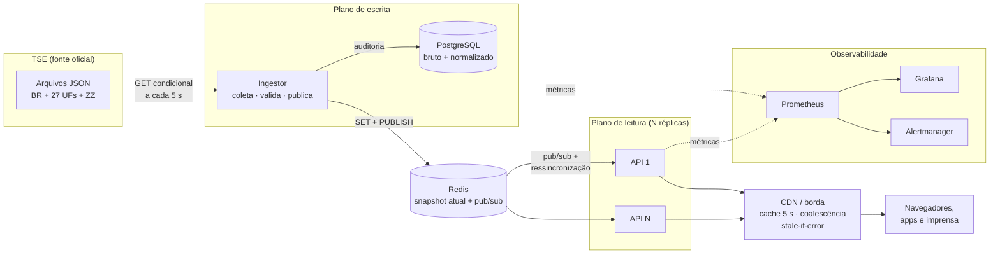
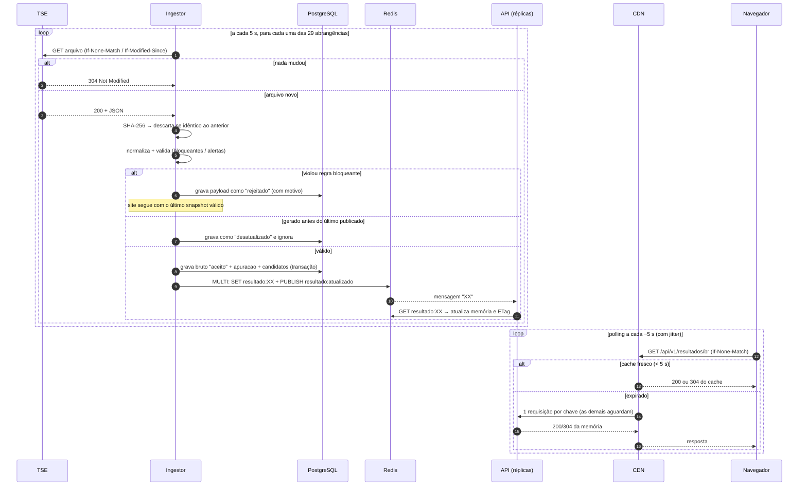
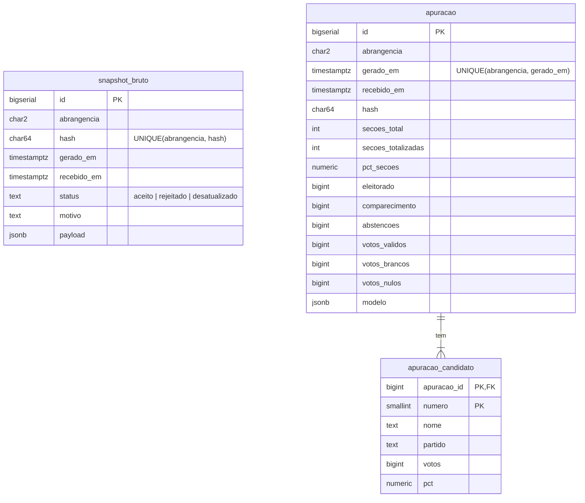
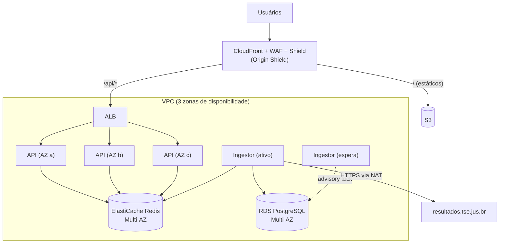
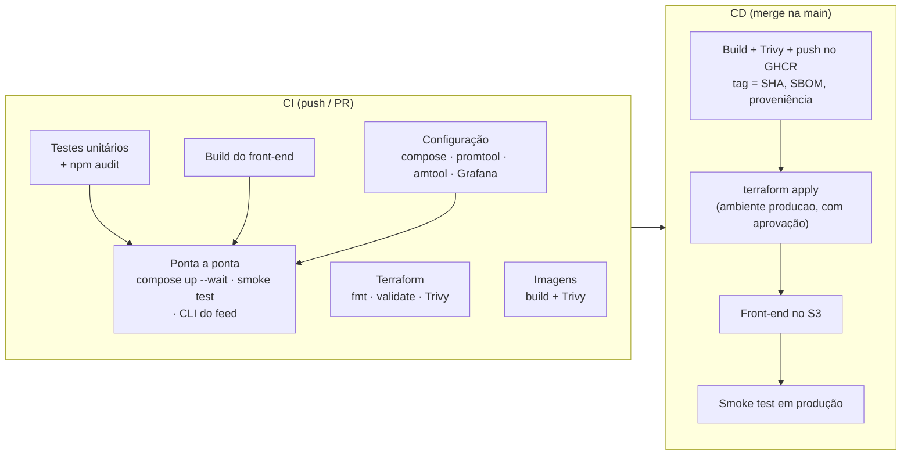

# Arquitetura: site de apuração presidencial

> Documento de arquitetura do site que publica, em tempo real, a apuração da eleição para
> Presidente da República a partir dos dados oficiais do TSE. A implementação de referência
> (rodando em `docker compose`) está neste mesmo diretório; ver o [README](../README.md).

## Sumário

1. [Contexto e objetivo](#1-contexto-e-objetivo)
2. [Requisitos](#2-requisitos)
3. [Princípios de design](#3-princípios-de-design)
4. [Visão geral](#4-visão-geral)
5. [Componentes](#5-componentes)
6. [Fluxo de um snapshot](#6-fluxo-de-um-snapshot)
7. [Tratamento e qualidade de dados](#7-tratamento-e-qualidade-de-dados)
8. [Modelo de dados](#8-modelo-de-dados)
9. [API pública](#9-api-pública)
10. [Estratégia de cache e orçamento de frescor](#10-estratégia-de-cache-e-orçamento-de-frescor)
11. [Capacidade e escala](#11-capacidade-e-escala)
12. [Resiliência e modos de falha](#12-resiliência-e-modos-de-falha)
13. [Observabilidade](#13-observabilidade)
14. [Segurança](#14-segurança)
15. [Implantação em produção](#15-implantação-em-produção)
16. [CI/CD](#16-cicd)
17. [Preparação para o dia da eleição](#17-preparação-para-o-dia-da-eleição)
18. [Decisões de arquitetura (ADRs)](#18-decisões-de-arquitetura-adrs)
19. [Pendências e próximos passos](#19-pendências-e-próximos-passos)

---

## 1. Contexto e objetivo

Na noite da eleição, milhões de pessoas abrem ao mesmo tempo um site para ver quem está
ganhando. O problema tem um formato bem particular, e é ele que guia toda a arquitetura:

| Característica | Consequência |
|---|---|
| **Todos veem o mesmo dado.** Não há personalização nem login. | O resultado pode ser pré-calculado uma vez e servido de cache para todo mundo. |
| **O dado muda pouco e devagar.** São 29 arquivos (BR, 27 UFs, exterior), regenerados pelo TSE a cada poucos segundos. | A escrita é rara e pequena; a leitura é massiva. Os dois caminhos devem ser separados. |
| **O pico é extremo e curto.** Do fechamento das urnas (17h de Brasília) até ~22h de um domingo. | Precisa aguentar o pico sem degradar; capacidade ociosa no resto do ano é aceitável (ou some com serverless/CDN). |
| **Corretude não é negociável.** Um número errado vira notícia e desinformação. | Todo dado passa por validação antes de ser publicado, e todo payload recebido fica auditável. |
| **Existe uma única fonte oficial: o TSE.** | O site espelha o TSE fielmente. Não faz projeções, não "corrige" dado. |

## 2. Requisitos

### Funcionais

| ID | Requisito |
|---|---|
| RF1 | Exibir o resultado nacional: % de seções totalizadas, votos e % de votos válidos por candidato, comparecimento, abstenções, brancos e nulos. |
| RF2 | Exibir o mesmo resultado para cada UF e para o exterior (ZZ). |
| RF3 | Atualizar automaticamente, sem o usuário recarregar a página. |
| RF4 | Indicar a situação final (eleito / 2º turno) quando o TSE a informar. |
| RF5 | Oferecer uma API pública JSON, somente leitura, que outros veículos possam consumir. |
| RF6 | Guardar o histórico de tudo o que foi recebido do TSE, para auditoria e análise. |

### Não funcionais (metas de projeto)

| Atributo | Meta |
|---|---|
| Disponibilidade | 99,9% das requisições com sucesso na borda durante a janela da eleição (16h–24h). |
| Frescor | p95 ≤ 30 s entre a geração do arquivo no TSE e o dado disponível na borda; alerta acima de 120 s. |
| Latência | p95 < 200 ms para o usuário (servido da CDN); p99 < 100 ms na origem. |
| Escala | Dimensionado para 2 milhões de usuários simultâneos, com margem de 10× na origem. |
| Corretude | Nunca publicar snapshot que viole as invariantes aritméticas; nunca "voltar no tempo". |
| Auditabilidade | Todo payload recebido é guardado com hash SHA-256, data de geração e data de recebimento. |

## 3. Princípios de design

1. **Fonte única.** Só o TSE alimenta o site. Nada de dado de terceiros ou estimativa própria.
2. **Pré-computar em vez de consultar.** O JSON que o usuário recebe já está pronto na
   memória. Nenhuma requisição de usuário toca banco de dados.
3. **Borda primeiro.** A CDN absorve praticamente todo o tráfego; a origem só atende a CDN.
4. **Degradar com elegância.** Se algo atrás da CDN falhar, o usuário continua vendo o último
   dado bom, com um aviso de que pode estar desatualizado, em vez de uma página de erro.
5. **Estado que só avança depois do commit.** Um snapshot só é dado como processado depois
   de gravado e publicado; qualquer falha no meio faz ele ser reprocessado, sem duplicar nada.
6. **Monitorar o dado, não só a máquina.** O sinal mais importante não é CPU: é "há quanto
   tempo o número na tela não muda?" e "o número que chegou faz sentido?".

## 4. Visão geral

A arquitetura separa um **plano de escrita** (pequeno, com uma instância ativa) de um **plano
de leitura** (sem estado, replicado, atrás de CDN).



## 5. Componentes

| Componente | Responsabilidade | Tecnologia (referência) | Estado | Escala |
|---|---|---|---|---|
| **Ingestor** (`services/ingestor`) | Busca os 29 arquivos do TSE, deduplica, normaliza, valida, grava a auditoria e publica. | Node.js 22, `pg`, `ioredis`, `prom-client` | Memória (último hash/ETag/modelo), reconstruído do Postgres no boot | 1 líder + 1 em espera (advisory lock no Postgres; failover medido em ~5 s) |
| **PostgreSQL** | Trilha de auditoria (payload bruto) e histórico normalizado para análises. **Fora do caminho de leitura.** | PostgreSQL 17 | Persistente | Vertical; Multi-AZ em produção |
| **Redis** | Guarda o snapshot atual de cada abrangência e notifica as APIs por pub/sub. | Redis 7 (AOF ligado) | Snapshot atual (≈ 50 KB no total) | Um nó primário + réplica |
| **API** (`services/api`) | Serve os JSONs a partir de uma cópia em memória, com ETag e cabeçalhos de cache para a CDN. | Node.js 22 (`node:http`, sem framework) | Sem estado (cópia em memória descartável) | Horizontal, sem limite prático |
| **Borda** (`web/nginx`) | Cache curto, coalescência de requisições, servir dado velho se a origem cair, limitar taxa por IP, servir o front. | Local: nginx · Produção: CDN + WAF | Cache efêmero | Gerenciada pela CDN |
| **Front-end** (`web`) | SPA que faz polling da API e exibe os resultados. | React 19 + Vite, arquivos estáticos | Nenhum | Estático na CDN |
| **Observabilidade** (`infra/`) | Métricas, alertas, roteamento de notificações e painéis de saúde do pipeline e qualidade do dado. | Prometheus, Alertmanager, Grafana | Séries temporais | — |
| **Simulador do TSE** (`services/mock-tse`) | Só para desenvolvimento e CI: imita o feed do TSE com dados fictícios e injeção de falhas, ou reproduz uma gravação real (modo replay). | Node.js, sem dependências | — | — |
| **CLI do feed** (`services/ingestor/src/cli/feed.js`) | Valida o feed real contra o adaptador e as regras de qualidade; grava o feed para replay. | Node.js | Arquivos gravados | — |

## 6. Fluxo de um snapshot



## 7. Tratamento e qualidade de dados

### 7.1 Camadas

O pipeline segue a ideia de camadas de um data lake (bruto → tratado → publicado):

| Camada | Onde | Conteúdo | Para quê |
|---|---|---|---|
| **Bruta** | `snapshot_bruto` (Postgres) | Todo arquivo novo recebido, aceito ou não, com o payload original em `jsonb`, hash, `gerado_em`, `recebido_em`, status e motivo. | Auditoria e reprocessamento: dá para provar o que o TSE publicou e quando. |
| **Normalizada** | `apuracao` + `apuracao_candidato` (Postgres) | Um registro por snapshot aceito, com tipos corretos; votos por candidato em tabela própria. | Análises em SQL (evolução da apuração, atraso de ingestão). |
| **Publicada** | `resultado:XX` (Redis) → memória da API → CDN | O JSON público, pronto para servir. | Leitura em massa. |

### 7.2 Normalização (`services/ingestor/src/normalizar.js`)

O layout do TSE tem particularidades que precisam ser tratadas num único lugar (adaptador):

- **Números chegam como texto** (`"156454011"`). O parsing é estrito: qualquer coisa que não
  seja só dígitos vira `NaN` e é barrada pela validação, em vez de virar um número errado.
- **Percentuais usam vírgula decimal** (`"50,90"` → `50.9`).
- **Data e hora vêm separadas, no horário de Brasília** (`dg: "04/10/2026"`, `hg: "19:42:10"`)
  e são convertidas para ISO 8601 com fuso (`2026-10-04T19:42:10-03:00`).
- Candidatos são ordenados por votos (desempate pelo número).

Se o TSE mudar o layout, só esse arquivo muda. Ver o mapeamento campo a campo na
[seção 19](#19-pendências-e-próximos-passos).

### 7.3 Regras de qualidade (`services/ingestor/src/validar.js`)

As regras têm duas severidades, e a diferença entre elas é uma decisão de arquitetura
([ADR-3](#adr-3-regras-bloqueantes-x-alertas)):

| Regra | Severidade | O que verifica |
|---|---|---|
| `esquema` | Bloqueante | Campos obrigatórios presentes e inteiros; data válida; abrangência conhecida; lista de candidatos não vazia; **eleição e turno iguais aos configurados**. |
| `soma_candidatos` | Bloqueante | Soma dos votos dos candidatos = votos válidos. |
| `secoes_limite` | Bloqueante | Seções totalizadas ≤ total de seções. |
| `pct_secoes` | Bloqueante | % de seções informado = calculado (tolerância de 0,01 p.p., arredondamento do TSE). |
| `pct_candidato` | Bloqueante | % de cada candidato informado = calculado. |
| `comparecimento_limite` | Bloqueante | Comparecimento ≤ eleitorado das seções apuradas. |
| `votos_limite` | Bloqueante | Válidos + brancos + nulos ≤ comparecimento. |
| `regressao_secoes` | Alerta | Seções totalizadas diminuíram em relação ao snapshot anterior. |
| `regressao_votos` | Alerta | Votos de algum candidato diminuíram em relação ao snapshot anterior. |

- **Bloqueante:** o arquivo não é publicado, fica na camada bruta como `rejeitado` com o motivo,
  e o site continua mostrando o último snapshot bom.
- **Alerta:** o arquivo é publicado (o TSE é a fonte da verdade; uma retotalização legítima não
  pode congelar o site) e a violação vai para o monitoramento, para alguém analisar.

### 7.4 Deduplicação, idempotência e ordenação

- **GET condicional** (`If-None-Match`/`If-Modified-Since`): quando nada mudou o TSE responde
  `304`, sem corpo. Economiza banda dos dois lados.
- **Hash SHA-256 do corpo:** conteúdo idêntico ao último processado é descartado.
- **`UNIQUE (abrangencia, hash)`** e **`UNIQUE (abrangencia, gerado_em)`** com `ON CONFLICT DO
  NOTHING`: reprocessar o mesmo snapshot (após uma falha ou reinício) nunca duplica linhas.
- **Nunca voltar no tempo:** um arquivo com `gerado_em` menor ou igual ao do último publicado é
  marcado como `desatualizado` e ignorado. Isso protege contra um ponto de presença da CDN do
  TSE servindo uma cópia antiga.
- **Semântica de commit:** hash, ETag e modelo em memória só avançam depois que Postgres **e**
  Redis confirmaram. Se o Redis falhar após o Postgres gravar, o próximo ciclo baixa o mesmo
  arquivo de novo (o ETag não avançou), as gravações no Postgres viram no-op e a publicação é
  refeita. Esse caso tem teste automatizado (`services/ingestor/test/ingestor.test.js`).

### 7.5 Consistência entre arquivos

O arquivo BR deveria ser a soma das 27 UFs com o exterior. Como os arquivos são gerados e
baixados em instantes ligeiramente diferentes, uma divergência curta é normal. Por isso ela
**não bloqueia** a publicação: vira a métrica `apuracao_divergencia_consolidacao`, e o alerta
`DivergenciaBRxUFs` só dispara se a divergência persistir por 5 minutos.

## 8. Modelo de dados



Esquema completo em [`services/ingestor/sql/001_esquema.sql`](../services/ingestor/sql/001_esquema.sql),
com as views `vw_ultima_apuracao`, `vw_atraso_ingestao` e `vw_evolucao_candidato`. O arquivo é
idempotente e aplicado pelo ingestor **depois de virar líder**, no boot: a mesma migração vale para
o compose e para o RDS, e nunca há duas instâncias aplicando DDL ao mesmo tempo. Exemplos de consulta:

```sql
-- Atraso entre a geração no TSE e a chegada ao banco (p50 / p95 / máx) por abrangência
SELECT abrangencia,
       percentile_cont(0.5)  WITHIN GROUP (ORDER BY atraso) AS p50,
       percentile_cont(0.95) WITHIN GROUP (ORDER BY atraso) AS p95,
       max(atraso)                                           AS maximo
  FROM vw_atraso_ingestao
 GROUP BY abrangencia
 ORDER BY p95 DESC;

-- Snapshots rejeitados e o motivo
SELECT abrangencia, gerado_em, recebido_em, motivo
  FROM snapshot_bruto
 WHERE status = 'rejeitado'
 ORDER BY recebido_em DESC;

-- Evolução do % de cada candidato no Brasil conforme as seções eram totalizadas
SELECT gerado_em, pct_secoes, numero, nome, pct
  FROM vw_evolucao_candidato
 WHERE abrangencia = 'BR'
 ORDER BY gerado_em, numero;
```

## 9. API pública

Somente leitura (`GET`/`HEAD`; outros métodos → `405`), JSON, com CORS liberado por ser dado
público.

| Rota | Descrição | Respostas |
|---|---|---|
| `GET /api/v1/resultados/{abr}` | Resultado de uma abrangência: `br`, `ac` … `to`, `zz` (exterior). | `200`, `304`, `404` (abrangência inválida), `503` (ainda sem dado) |
| `GET /api/v1/resultados` | Resumo de todas as abrangências (% de seções, 1º e 2º colocados). | `200`, `304`, `503` |
| `GET /health/live` · `/health/ready` | Sondas de vida e prontidão (não expostas pela borda). | `200` / `503` |
| `GET /metrics` | Métricas Prometheus (não expostas pela borda). | `200` |

Cabeçalhos das respostas `200`:

```
Cache-Control: public, max-age=5, stale-while-revalidate=30, stale-if-error=600
ETag: "<versão do snapshot>"
Access-Control-Allow-Origin: *
```

Exemplo (abreviado) de `GET /api/v1/resultados/br`:

```json
{
  "eleicao": "9001",
  "abrangencia": "BR",
  "turno": 1,
  "geradoEm": "2026-10-04T19:42:10-03:00",
  "secoes": { "total": 473893, "totalizadas": 294393, "pct": 62.12 },
  "eleitorado": { "total": 156380000, "apurado": 97146843 },
  "comparecimento": { "total": 77373958, "pct": 79.65 },
  "abstencoes": { "total": 19772885, "pct": 20.35 },
  "votos": { "validos": 73627239, "brancos": 1329384, "nulos": 2417335 },
  "candidatos": [
    { "numero": 91, "nome": "CANDIDATA ALFA", "partido": "PARTIDO ALFA",
      "votos": 27872850, "pct": 37.86, "eleito": false, "situacao": "" }
  ],
  "fonte": "tse",
  "versao": "514a160cbd2d9185"
}
```

`fonte` vale `simulada` quando os dados vêm do simulador; o front-end mostra uma faixa
"Dados simulados — não são resultados oficiais" nesse caso.

## 10. Estratégia de cache e orçamento de frescor

### 10.1 Camadas de cache

| Camada | O que guarda | Validade | Invalidação |
|---|---|---|---|
| Navegador | Última resposta + ETag | Sempre revalida (`fetch` com `cache: 'no-cache'`) | ETag → `304` barato |
| **CDN / borda** | JSON por URL | `max-age=5`; serve velho por até 30 s enquanto revalida e por até 10 min se a origem falhar | Expiração por tempo. Sem purge: com TTL de 5 s, não compensa. |
| API (memória) | Os 29 JSONs + resumo, com ETag | Até chegar versão nova | Pub/sub do Redis + ressincronização completa a cada 30 s |
| Redis | Snapshot atual por abrangência | Até o ingestor publicar outro | Sobrescrito pelo ingestor; republicado a cada 60 s (anti-entropia) |

Dois detalhes que importam:

- **Coalescência de requisições** (`proxy_cache_lock` no nginx, "request collapsing" nas CDNs):
  quando o cache expira, só uma requisição por URL vai à origem e as demais aguardam a resposta.
  Sem isso, cada expiração viraria uma rajada de milhares de requisições na API.
- **O tempo máximo de dado velho é limitado pelos cabeçalhos da origem**, não por configuração
  da borda. Durante os testes, `proxy_cache_use_stale updating` fez o nginx servir na primeira
  requisição, depois de um período ocioso, um resumo com mais de 1 minuto de idade, porque esse
  parâmetro tem precedência sobre `stale-while-revalidate` e não tem limite de idade. Ele foi
  removido; o comportamento ficou a cargo de `stale-while-revalidate=30` e `stale-if-error=600`.

### 10.2 Orçamento de frescor (do TSE à tela)

| Etapa | Pior caso típico |
|---|---|
| Ingestor percebe o arquivo novo (intervalo de coleta) | ≤ 5 s |
| Validação + Postgres + Redis | < 0,1 s |
| Pub/sub até a memória das APIs | < 0,05 s (até 30 s se a mensagem se perder; ver alerta `ApiServindoDadoAntigo`) |
| Cache da borda | ≤ 5 s (até 35 s no primeiro acesso a uma URL fria) |
| Polling do navegador | ≤ 6 s (5 s ± 20% de jitter) |
| **Total** | **≈ 16 s**, folgado dentro da meta de 30 s no p95 |

A latência do próprio TSE para gerar o arquivo fica fora do nosso controle. Ela aparece em
`vw_atraso_ingestao` e na métrica `ingestor_dados_idade_segundos`.

## 11. Capacidade e escala

Estimativa para **2 milhões de usuários simultâneos** (meta de projeto), medida com os payloads
reais da implementação: resultado BR com 1,2 KB (508 B com gzip), resumo com 6,5 KB (912 B com
gzip), `304` só com cabeçalhos (~300 B).

| Grandeza | Cálculo | Resultado |
|---|---|---|
| Requisições na borda | 2 M × (1/5 s para o resultado + 1/10 s para o resumo) | **≈ 600 mil req/s** |
| Banda na borda | ~metade das respostas `304` (o dado muda a cada ~10 s) → ~0,19 KB/s por usuário | **≈ 370 MB/s (~3 Gbps)**: rotina para uma CDN |
| Requisições na origem, com origin shield | 30 URLs ÷ 5 s × ~3 nós de shield | **≈ 20 req/s** |
| Requisições na origem, sem shield | 30 URLs ÷ 5 s × ~50 pontos de presença | **≈ 300 req/s** |
| Capacidade de uma réplica da API | Resposta da memória, sem I/O | milhares de req/s por vCPU |

Conclusão: **a origem não é gargalo.** O número de réplicas da API é decidido por
disponibilidade (mínimo de 3, uma por zona) e não por capacidade. O que precisa de atenção é a
CDN: contratação, origin shield, coalescência ligada e teste de carga contra ela.

O jitter de ±20% no polling do front-end importa: sem ele, os navegadores que abriram a página
juntos ficam sincronizados e batem na CDN em ondas.

### 11.1 Teste de carga (medido)

Rodado com k6 (`scripts/carga/`) numa máquina de **4 vCPUs** que hospedava, ao mesmo tempo, o
gerador de carga e todo o ambiente do compose. Os números são um piso, não o teto da arquitetura.
A mistura de rotas imita o front-end (60% resultado BR, 30% resumo, 10% UFs) e cada usuário
virtual revalida com `If-None-Match`, como o navegador.

| Cenário | Vazão sustentada | Erros | p95 | p99 | Requisições que chegaram à API |
|---|---|---|---|---|---|
| Borda (nginx), 3.000 req/s alvo, 1 min | 210 mil requisições | 0% | 0,9 ms | 3,2 ms | **194** (99,9% absorvidas pelo cache) |
| Borda (nginx), 10.000 req/s alvo, 45 s | ~7.300 req/s (a máquina saturou) | 0% | 77 ms | 128 ms | **154** |
| Origem direta (2 réplicas da API, sem cache), 4.000 req/s, 45 s | 220 mil requisições | 0% | 1,1 ms | 3,9 ms | 220 mil (dividido ~50/50 entre as réplicas) |

O que o teste confirma:

- **A coalescência funciona:** com milhares de requisições por segundo na borda, a origem recebe
  poucas por segundo (cerca de uma por URL a cada 5 s), independentemente da carga.
- **A origem é barata:** 2 réplicas, servindo da memória, aguentaram 4.000 req/s com p99 < 4 ms
  usando ~40 MB de RAM cada.
- **O limite medido foi a máquina de teste**, não um componente. O próximo passo é repetir contra
  o CloudFront em homologação, com geradores distribuídos.

Para rodar: `docker compose -f docker-compose.yml -f docker-compose.carga.yml up -d` (desliga o
limite por IP, já que o k6 sai de um só IP) e `TAXA=3000 ./scripts/carga/rodar.sh`
(`ALVO=origem` para ir direto na API).

## 12. Resiliência e modos de falha

✔ = cenário exercitado localmente com esta implementação.

| Falha | Efeito para o usuário | Mitigação | Detecção |
|---|---|---|---|
| TSE fora do ar / respondendo 5xx | Continua vendo o último dado; aviso de "desatualizado" após 3 min | Ingestor tenta de novo a cada ciclo, sem tempestade de retries | `FonteComFalhas`, `ResultadoNacionalDesatualizado` ✔ |
| TSE publica arquivo inconsistente | Nenhum: o arquivo não é publicado | Regras bloqueantes; o próximo arquivo bom passa normalmente | `SnapshotRejeitado` ✔ |
| CDN do TSE devolve versão antiga | Nenhum | Regra "nunca voltar no tempo" | Status `desatualizado` no banco (teste unitário) |
| TSE muda o layout do arquivo | Dado congela no último válido | Esquema bloqueia; corrigir o adaptador `normalizar.js` e publicar | `RejeicaoPersistente` (crítico) |
| Ingestor líder cai | Nenhum (pausa de ~5 s nas atualizações) | A instância em espera obtém o advisory lock e assume (4,5 s medidos com `docker kill`); se o próprio líder reiniciar primeiro, ele retoma o lock. Ao assumir, reidrata a memória e o Redis a partir do Postgres | `IngestorSemLider`, `IngestorParado` ✔ |
| Ingestor perde a conexão do lock | Nenhum | O processo sai imediatamente (sem lock não há garantia de escritor único) e volta como candidato; uma sobreposição breve é inofensiva porque as gravações são idempotentes | `IngestorComDoisLideres` |
| PostgreSQL fora | Dado congela no último válido | Postgres em Multi-AZ (failover ~1 min). Publicar exige auditoria ([ADR-4](#adr-4-auditoria-é-pré-requisito-para-publicar)) | `FalhaDePersistencia` |
| Redis perde os dados | Nenhum: as APIs mantêm a cópia em memória | AOF + republicação periódica pelo ingestor (restaurado em < 30 s no teste) | Log e `FalhaDePersistencia` ✔ |
| Mensagem de pub/sub perdida | Uma réplica atrasa até 30 s | Ressincronização completa a cada 30 s | `ApiServindoDadoAntigo` |
| Uma réplica da API cai | Nenhum | Balanceador remove a réplica; as demais seguem | `ApiReplicaFora` |
| Todas as réplicas da API caem | Continua vendo o último dado por até 10 min | `stale-if-error=600` na borda (respostas `STALE` no teste) | `ApiReplicaFora`, `ApiErros5xx` ✔ |
| Pico acima do previsto / DDoS | Nenhum, se a CDN segurar | CDN + WAF + rate limit por IP; a origem só aceita tráfego da CDN | Métricas da CDN/WAF |
| Deploy com defeito | Possível regressão | Congelamento de mudanças na semana da eleição; imagens imutáveis com rollback imediato; canário | Smoke test pós-deploy |

## 13. Observabilidade

### 13.1 SLIs e SLOs

| SLI | Como medir | SLO |
|---|---|---|
| **Frescor do dado** | `ingestor_dados_idade_segundos{abrangencia="BR"}` enquanto a apuração não termina | p95 ≤ 30 s; nunca > 120 s por mais de 1 min |
| **Corretude** | Snapshots publicados que violam invariantes | Zero (garantido pela validação; verificado no smoke test) |
| **Disponibilidade** | Respostas 2xx/3xx ÷ total, medido na CDN | ≥ 99,9% |
| **Latência da origem** | `http_requisicao_duracao_segundos` | p99 < 100 ms |
| **Coerência entre réplicas** | `api_dados_idade_segundos` − `ingestor_dados_idade_segundos` | ≤ 30 s |

### 13.2 Métricas

Além das métricas padrão de processo Node.js. Todas as combinações conhecidas de rótulos dos
contadores nascem com valor 0 (ver 13.5).

| Métrica | Tipo | Para quê |
|---|---|---|
| `ingestor_coletas_total{abrangencia,resultado}` | contador | Saúde da fonte: `novo`, `nao_modificado`, `duplicado`, `erro_http`, `erro_rede` |
| `ingestor_coleta_duracao_segundos` | histograma | Latência do TSE |
| `ingestor_snapshots_total{abrangencia,status}` | contador | `aceito`, `rejeitado`, `desatualizado` |
| `ingestor_violacoes_total{abrangencia,regra,severidade}` | contador | Qual regra de qualidade está falhando, e onde |
| `ingestor_dados_idade_segundos{abrangencia}` | gauge | **O sinal principal:** idade do último dado aceito |
| `ingestor_falhas_persistencia_total{destino}` | contador | Postgres / Redis |
| `ingestor_ultimo_ciclo_timestamp_segundos` | gauge | Detecta ingestor travado |
| `ingestor_lider` | gauge | 1 no líder, 0 em espera (a soma deve ser exatamente 1) |
| `apuracao_secoes_totalizadas_pct{abrangencia}` | gauge | Progresso da apuração |
| `apuracao_votos_candidato{abrangencia,candidato}` | gauge | Curva da apuração no Grafana |
| `apuracao_divergencia_consolidacao{campo}` | gauge | BR × soma das UFs |
| `http_requisicoes_total{rota,status}` / `http_requisicao_duracao_segundos{rota}` | contador / histograma | Golden signals da API (rótulo de rota com cardinalidade fixa) |
| `api_dados_idade_segundos{abrangencia}` | gauge | Idade do dado que **cada réplica** está servindo |

### 13.3 Alertas

Definidos em [`infra/prometheus/alertas.yml`](../infra/prometheus/alertas.yml) (16 regras,
validadas com `promtool` no CI):

| Alerta | Severidade | Dispara quando |
|---|---|---|
| `ResultadoNacionalDesatualizado` | crítica | BR sem dado novo há > 2 min **e** apuração < 100% |
| `ResultadoUFDesatualizado` | alta | Alguma UF sem dado novo há > 5 min e < 100% |
| `RejeicaoPersistente` | crítica | Uma abrangência só teve rejeições nos últimos 5 min |
| `SnapshotRejeitado` | média | Qualquer rejeição (investigar em `snapshot_bruto`) |
| `RegressaoNaApuracao` | média | Regra de alerta violada (dado publicado, requer análise) |
| `DivergenciaBRxUFs` | média | BR ≠ soma das UFs por 5 min |
| `IngestorParado` | crítica | Líder sem ciclo completo há > 30 s, ou nenhuma instância no ar |
| `IngestorSemLider` | crítica | Ninguém segura o lock por 30 s (failover falhou) |
| `IngestorComDoisLideres` | crítica | Mais de uma instância se declara líder por 30 s |
| `IngestorSemEspera` | média | Só uma instância por 5 min (não há quem assuma) |
| `FonteComFalhas` | alta | > 20% das coletas falhando por 2 min |
| `FalhaDePersistencia` | crítica | Falhas contínuas no Postgres ou Redis |
| `ApiErros5xx` | alta | > 1% de 5xx por 5 min |
| `ApiLatenciaAlta` | média | p99 > 100 ms por 5 min |
| `ApiReplicaFora` | alta | Réplica sem responder ao scrape |
| `ApiServindoDadoAntigo` | alta | Alguma réplica > 30 s atrás do ingestor |

Os alertas de frescor só disparam com a apuração **abaixo de 100%**: depois que tudo foi
totalizado o TSE para de gerar arquivos, e a idade do dado cresce sem que isso seja problema.

**Roteamento** ([`infra/alertmanager/alertmanager.yml`](../infra/alertmanager/alertmanager.yml)):
tudo vai para a sala de guerra; o que é crítico também aciona o plantão, com repetição a cada
5 min. Localmente os dois destinos são um receptor que imprime os alertas
(`docker compose logs -f receptor-alertas`); os blocos de Slack e PagerDuty estão comentados no
arquivo. Regras de inibição evitam avalanche: com `IngestorParado` ou `IngestorSemLider`
disparados, os alertas de dado desatualizado (sintoma) não notificam; `RejeicaoPersistente`
silencia `SnapshotRejeitado` da mesma UF. As notificações são agrupadas por tipo de alerta.

Validado de ponta a ponta: com a fonte desligada, `FonteComFalhas` chegou à sala de guerra e
`ResultadoNacionalDesatualizado` ao plantão em ~3 min; ao religar, chegaram as resoluções.

### 13.4 Logs e painéis

- **Logs estruturados em JSON**, uma linha por evento, com `servico`, `abrangencia`, `motivo` etc.
  Em produção vão para um agregador (Loki, CloudWatch, Elastic).
- O access log da borda registra `cache` (`HIT`/`MISS`/`STALE`…) e o tempo da origem, o que
  permite medir a taxa de acerto do cache.
- **Painel do Grafana** provisionado automaticamente (`infra/grafana/dashboards/apuracao.json`),
  com três blocos: apuração (progresso, curva de votos, % por UF), ingestão e qualidade
  (coletas por resultado, snapshots por desfecho, violações por regra, idade do dado,
  latência do TSE, divergência), API (req/s por status, latência p50/p95/p99, idade do dado
  por réplica) e plataforma (líder do ingestor, instâncias, réplicas, alertas disparados).

### 13.5 Lições dos testes de monitoramento

Três problemas só apareceram exercitando os alertas de verdade, e ficam como regra para o projeto:

1. **Contador que nasce no primeiro incremento não dispara alerta.** `increase()` não enxerga o
   salto de "série inexistente" para 1, então a *primeira* rejeição ou regressão de cada UF
   passava em silêncio (203 violações registradas, nenhum alerta). Correção: todas as séries
   conhecidas são criadas com 0 no boot (`inicializarSeries` em `metricas.js`), com teste.
2. **Agrupar por UF gera ruído.** Um único incidente (reinício da fonte) virou 50 notificações.
   Agora o agrupamento é por tipo de alerta, listando as UFs afetadas.
3. **`continue: true` não volta para o receptor da raiz.** O alerta crítico ia só para o plantão
   e sumia da sala de guerra; foi preciso uma rota explícita para ela (verificado com
   `amtool config routes test`).

## 14. Segurança

| Tema | Medida |
|---|---|
| Superfície de ataque | API somente leitura, sem autenticação nem dado pessoal. Escrita só pelo ingestor, numa rede interna. |
| DDoS e abuso | CDN com proteção DDoS e WAF; rate limit por IP na borda (20 req/s, rajada de 40). A origem aceita tráfego só da CDN (allow-list de IPs ou cabeçalho secreto). |
| Exposição interna | `/metrics` e `/health/*` não passam pela borda; Postgres, Redis e Prometheus não ficam expostos publicamente (no compose, só em `127.0.0.1`). |
| Contêineres | Imagens Alpine, processos sem root (`USER node`, `nginx-unprivileged`), só dependências de produção, sistema de arquivos somente leitura no ECS. O npm (com dependências próprias vulneráveis) é removido da imagem final, que roda `node` direto; a imagem do nginx aplica `apk upgrade`. |
| Cadeia de suprimentos | `npm ci` com lockfile e `npm audit` no CI; **Trivy** nas 4 imagens (bloqueia HIGH/CRITICAL com correção disponível) e no Terraform; o CD publica as imagens com **SBOM e proveniência**. Próximo passo: assinatura (cosign). |
| Rede na AWS | Grupos de segurança com regras mínimas: ALB só recebe do CloudFront e só envia à API; API só alcança Redis e HTTPS; Postgres só aceita o ingestor. Exceções aceitas e documentadas no código (`#trivy:ignore`): ALB público e HTTP até haver domínio próprio; saída HTTPS ampla do ingestor (o TSE fica atrás de CDN, com IPs variáveis). |
| Segredos | Nunca no repositório. Local: `.env` (fora do Git). Produção: gerenciador de segredos (AWS Secrets Manager, Vault). |
| Cabeçalhos HTTP | CSP restritiva (`default-src 'self'`, `frame-ancestors 'none'`), `nosniff`, `Referrer-Policy`, `Permissions-Policy`. |
| Integridade e desinformação | O site só exibe dado validado, sempre cita o TSE e marca claramente dados simulados; o payload de cada snapshot fica guardado com hash para auditoria. Deploy imutável dificulta defacement. |
| LGPD | Só dados públicos agregados. Os únicos dados pessoais são IPs nos logs de acesso: retenção curta e acesso restrito. |

## 15. Implantação em produção

Implementado em Terraform em [`infra/terraform/`](../infra/terraform) (validado com
`terraform validate` e Trivy; ainda não aplicado numa conta real). Região padrão `sa-east-1`
(São Paulo). Mapeamento da implementação local para a AWS:

| Local (`docker compose`) | Produção (exemplo AWS) |
|---|---|
| `web` (nginx: estáticos + cache) | **CloudFront** com Origin Shield + **S3** para os estáticos + **AWS WAF** + Shield |
| `api` (2 réplicas) | **ECS Fargate**: 3 a 30 tarefas em 3 AZs atrás de um ALB, autoscaling por CPU (alvo 50%), circuit breaker com rollback |
| `ingestor` (2 réplicas) | ECS Fargate: 2 tarefas (líder + espera via `pg_try_advisory_lock`) |
| `redis` | **ElastiCache for Redis** Multi-AZ |
| `postgres` | **RDS PostgreSQL** ou Aurora, Multi-AZ |
| `prometheus` + `grafana` | Amazon Managed Prometheus + Managed Grafana (ou `kube-prometheus-stack`) |
| — | **Alertmanager** → PagerDuty/Opsgenie + Slack da sala de guerra |
| `.env` | Secrets Manager: senha do RDS gerada e rotacionada pelo próprio RDS, entregue à tarefa como `PGPASSWORD` |
| `mock-tse` | Só em CI e homologação |



Detalhes que importam na configuração:

- **`PriceClass_All` no CloudFront:** as classes mais baratas não incluem os pontos de presença
  da América do Sul, o que mandaria o público brasileiro para os EUA.
- **Origin Shield em `sa-east-1`:** os pontos de presença pedem ao shield, e só ele pede ao ALB.
- **Cache policy da API com TTL vindo da origem** (`min 0 / padrão 5 / máx 60`), para o
  `max-age=5, stale-while-revalidate, stale-if-error` da API valer também no CloudFront.
- **WAF:** limite de 6.000 requisições por IP a cada 5 min (generoso por causa do CGNAT das
  operadoras móveis, em que muitos usuários compartilham um IP) e regras gerenciadas da AWS.
- **ALB protegido em duas camadas:** só aceita os IPs de origem do CloudFront e, entre eles, só
  quem envia o cabeçalho secreto `X-Origem-Cloudfront`.
- **Front-end no S3** com versionamento (rollback do front) e `Cache-Control` por tipo de
  arquivo: `index.html` sem cache, `assets/` imutáveis.

Uma região é suficiente: a borda já esconde falhas da origem por até 10 minutos, e uma segunda
região ativa/passiva com failover de DNS custa mais do que o risco justifica para uma janela de
poucas horas. Se o requisito de disponibilidade subir, essa é a evolução natural.

## 16. CI/CD

Dois workflows: [`apuracao-ci.yml`](../../.github/workflows/apuracao-ci.yml) em todo push e PR,
e [`apuracao-cd.yml`](../../.github/workflows/apuracao-cd.yml) a cada merge na `main`.



O teste de ponta a ponta sobe o ambiente inteiro com o simulador e roda
`scripts/smoke-test.sh` (invariantes do JSON publicado, cache na borda, `404`, front-end, trilha de
auditoria no Postgres e alvos do Prometheus); depois roda a CLI de validação do feed contra o
simulador.

O job de implantação só roda se o repositório tiver a variável `AWS_ROLE_ARN` (papel IAM
assumido via OIDC, sem chave de acesso guardada no GitHub), além de `TF_STATE_BUCKET`,
`ELEICAO` e, opcionalmente, `AWS_REGION` e `TURNO`. Ele usa o ambiente `producao` do GitHub:
configure revisores obrigatórios para que nenhum deploy saia sem aprovação.
**Congelamento de mudanças na semana da eleição**: só correções críticas, com aprovação.

## 17. Preparação para o dia da eleição

| Quando | Atividade |
|---|---|
| D-60 | Validar o adaptador com `npm run feed -- validar` contra o feed real e **gravar** um ciclo completo (simulado do TSE ou eleição anterior) com `npm run feed -- gravar`; reproduzir com `docker-compose.replay.yml`. |
| D-30 | **Teste de carga** contra a CDN e a origem (k6/Gatling) com 2× o pico previsto. |
| D-30 | **Game day**: derrubar API, Redis, Postgres e ingestor em homologação; injetar falhas com `FALHA_TAXA_5XX` e `FALHA_TAXA_INCONSISTENTE`; conferir alertas e runbooks. |
| D-7 | Congelamento de mudanças. Revisão de capacidade e de contatos de plantão. |
| D-1 | Confirmar o **código da eleição** e do turno no `ele-c.json` do TSE; configurar `ELEICAO`, `TURNO`, `FONTE_URL_TEMPLATE`, `FONTE_NOME=tse`. Escalar a API antecipadamente. |
| Dia | Sala de guerra a partir das 15h; painel do Grafana na tela; rodar o smoke test em produção às 16h. |
| D+1 | Exportar `snapshot_bruto` para armazenamento frio; pós-mortem; reduzir a infraestrutura. |

## 18. Decisões de arquitetura (ADRs)

### ADR-1: Polling na CDN em vez de WebSocket/SSE

- **Contexto:** o dado é o mesmo para todos e muda a cada ~10 s.
- **Decisão:** o front-end faz polling a cada 5 s (com jitter) de JSONs cacheados na CDN.
- **Consequências:** cada requisição é stateless e cacheável; a CDN absorve tudo. Push com 2 M de
  conexões abertas exigiria uma camada dedicada de fan-out (custo e complexidade) para ganhar
  poucos segundos de frescor. Se um dia o requisito for "atualização em < 1 s", a alternativa é
  um serviço gerenciado de pub/sub na borda.

### ADR-2: Nenhum banco no caminho de leitura

- **Decisão:** as APIs servem da memória; o Redis só distribui; o Postgres serve a auditoria e as análises.
- **Consequências:** a latência e a capacidade da leitura não dependem de banco; uma lentidão
  no Postgres nunca derruba o site.

### ADR-3: Regras bloqueantes × alertas

- **Decisão:** inconsistência interna do arquivo bloqueia; regressão em relação ao snapshot
  anterior só alerta.
- **Consequências:** um arquivo corrompido nunca chega ao usuário; uma retotalização legítima do
  TSE (que pode reduzir votos) não congela o site. O alerta leva a uma análise humana.

### ADR-4: Auditoria é pré-requisito para publicar

- **Decisão:** um snapshot só é publicado depois de gravado no Postgres.
- **Trade-off:** se o Postgres cair, o site congela no último dado (com aviso), em vez de exibir
  um número sem trilha de auditoria. Fica aceitável com Postgres Multi-AZ (failover de ~1 min).
  Se o negócio preferir frescor a auditoria nesse cenário, a evolução é um modo degradado,
  ativado por flag, que publica e grava a auditoria depois.

### ADR-5: Um único ingestor ativo, com outro em espera

- **Decisão:** duas instâncias; só a que segura `pg_try_advisory_lock` coleta e publica. O lock
  pertence à sessão do Postgres: se o líder morrer, ele é liberado e a outra assume.
- **Por que o Postgres e não o Redis:** o ingestor já depende do Postgres para publicar
  ([ADR-4](#adr-4-auditoria-é-pré-requisito-para-publicar)), então o lock não acrescenta
  dependência; e o advisory lock é liberado pelo próprio banco quando a conexão cai, sem TTL para
  ajustar.
- **Consequências:** sem disputa de escrita nem ordenação distribuída; o volume (29 arquivos a
  cada 5 s) cabe com folga numa instância. Uma sobreposição breve entre dois líderes não corrompe
  nada, porque as gravações são idempotentes e a regra "nunca voltar no tempo" ordena as
  publicações.

### ADR-6: Node.js sem framework na API

- **Decisão:** `node:http` puro na API e no simulador.
- **Consequências:** imagem pequena, poucas dependências (menos superfície na cadeia de
  suprimentos) e a mesma linguagem do front-end. O roteamento é trivial (duas rotas públicas),
  então um framework acrescentaria pouco.

## 19. Pendências e próximos passos

### 19.1 Validar o layout do TSE para 2026 (prioridade máxima)

O adaptador foi escrito com base no layout "dados simplificados" usado pelo TSE em 2022. **Não
foi possível conferir contra o feed real a partir do ambiente onde esta implementação foi
construída** (os domínios do TSE são bloqueados ali). A ferramenta para isso está pronta:

```bash
cd services/ingestor && npm ci
npm run feed -- validar                       # descobre a eleição no ele-c.json
npm run feed -- validar --eleicao <código>    # ou informa o código
npm run feed -- gravar --saida ../../gravacoes/$(date +%F) --parar-em-100
```

O `validar` baixa os 29 arquivos, lista os campos que o adaptador espera e não vieram (e os que
vieram e são ignorados), roda as regras de qualidade e sai com código 1 se algo falhar. O TSE
publicou a especificação técnica dos arquivos de 2026 na página "Informações técnicas sobre a
divulgação de resultados"; vale conferir o mapeamento abaixo contra ela:

| Campo TSE | Campo no modelo | Significado |
|---|---|---|
| `ele` | `eleicao` | Código da eleição (confirmar no `ele-c.json`) |
| `cdabr` | `abrangencia` | `BR`, sigla da UF ou `ZZ` (exterior) |
| `t` | `turno` | 1 ou 2 |
| `dg` + `hg` | `geradoEm` | Data e hora de geração (Brasília) |
| `s` / `st` / `pst` | `secoes.total` / `.totalizadas` / `.pct` | Seções |
| `e` / `ea` | `eleitorado.total` / `.apurado` | Eleitorado |
| `c` / `pc` | `comparecimento.total` / `.pct` | Comparecimento |
| `a` / `pa` | `abstencoes.total` / `.pct` | Abstenções |
| `vvc` | `votos.validos` | Votos válidos |
| `vb` | `votos.brancos` | Votos brancos |
| `tvn` | `votos.nulos` | Total de votos nulos |
| `cand[].n` / `nm` / `cc` | `numero` / `nome` / `partido` | Candidato |
| `cand[].vap` / `pvap` | `votos` / `pct` | Votos apurados e % dos válidos |
| `cand[].e` / `st` | `eleito` / `situacao` | `"s"` se eleito; texto da situação |

URL usada (padrão de 2022, a confirmar):
`https://resultados.tse.jus.br/oficial/ele2026/{eleicao}/dados-simplificados/{abr}/{abr}-c0001-e{eleicao6}-r.json`
(`c0001` = cargo Presidente). Verificar também os termos de uso e a frequência de consulta
recomendada pelo TSE.

### 19.2 Para colocar no ar de verdade

- **Rodar a validação contra o TSE** (19.1) e ajustar `normalizar.js` se o layout divergir.
- **Conta AWS:** criar o bucket de estado, o papel IAM para OIDC e as variáveis do repositório;
  rodar `terraform plan` (nunca foi executado contra uma conta real).
- **Domínio próprio:** certificado ACM no CloudFront e no ALB, e origem em HTTPS.
- **TLS verificado até o RDS:** trocar `sslmode=no-verify` por `verify-full` com o bundle de CA do
  RDS na imagem do ingestor.
- **Observabilidade na AWS:** coletar as métricas das tarefas (ADOT → Amazon Managed Prometheus) e
  ligar o Alertmanager ao Slack/PagerDuty.
- **Teste de carga contra o CloudFront** em homologação, com geradores distribuídos.

### 19.3 Evoluções

- **2º turno:** basta configurar `TURNO=2` e o novo código de eleição; o front-end já se adapta.
- **Mapa coroplético por UF** e, depois, **resultado por município** (5.570 arquivos: exige
  coleta escalonada e particionamento das tabelas por abrangência).
- **Modo degradado** do ADR-4 e assinatura de imagens (cosign).
- **Outros cargos** (governador, senador): o mesmo pipeline, parametrizado pelo cargo (`c0003`, …).
